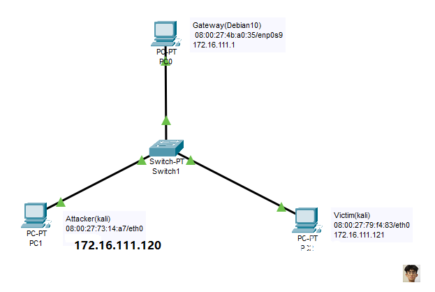
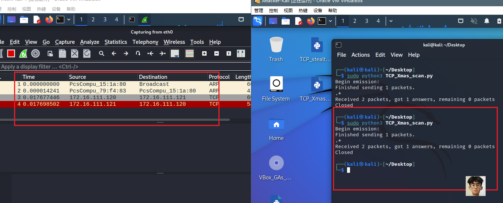
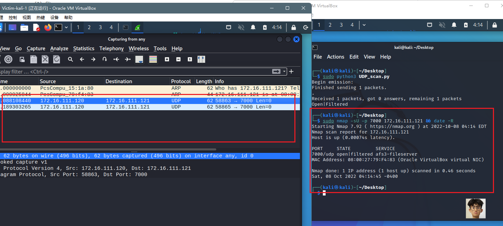

# 基于Scapy编写端口扫描器

### 实验目的

- 掌握网络扫描之端口状态检测的基本原理

### 实验环境

- python+scapy+nmap
- Linux kali 5.18.0-kali5-amd64

### 实验要求

- 禁止探测互联网上的 IP ，严格遵守网络安全相关法律法规
- 完成以下扫描技术的编程实现
  - TCP connect scan / TCP stealth scan
  - TCP Xmas scan / TCP fin scan / TCP null scan
  - UDP scan
- 上述每种扫描技术的实现测试均需要测试端口状态为：`开放`、`关闭` 和 `过滤` 状态时的程序执行结果
- 提供每一次扫描测试的抓包结果并分析与课本中的扫描方法原理是否相符？如果不同，试分析原因；
- 在实验报告中详细说明实验网络环境拓扑、被测试 IP 的端口状态是如何模拟的
- 复刻 `nmap` 的上述扫描技术实现的命令行参数开关

### 实验过程

#### 拓扑图



(和第四章实验相同，这里Attacker为扫描端，Victim作为被扫描的靶机)

#### 端口状态模拟

- 查看当前防火墙的状态和现有规则

  ```
  ufw status
  ```

- 关闭状态：对应端口没有开启监听, 防火墙没有开启。

  ```bash
  ufw disable
  ```

- 开启状态：对应端口开启监听，防火墙处于关闭状态。

  - apache2基于TCP, 在80端口提供服务;
  - DNS服务基于UDP,在53端口提供服务。

  ```bash
  systemctl start apache2 # port 80
  systemctl start dnsmasq # port 53
  ```

- 过滤状态：对应端口开启监听, 防火墙开启。

  ```bash
  ufw enable && ufw deny 80/tcp
  ufw enable && ufw deny 53/udp
  ```

#### TCP connect scan

> 先发送一个S，然后等待回应。如果有回应且标识为RA，说明目标端口处于关闭状态；如果有回应且标识为SA，说明目标端口处于开放状态。这时TCP connect scan会回复一个RA，在完成三次握手的同时断开连接.

##### code

```python
from scapy.all import *


def tcpconnect(dst_ip, dst_port, timeout=10):
    pkts = sr1(IP(dst=dst_ip)/TCP(dport=dst_port,flags="S"),timeout=timeout)
    if pkts is None:
        print("Filtered")
    elif(pkts.haslayer(TCP)):
        if(pkts.getlayer(TCP).flags == 0x12):  #Flags: 0x012 (SYN, ACK)
            send_rst = sr(IP(dst=dst_ip)/TCP(dport=dst_port,flags="AR"),timeout=timeout)
            print("Open")
        elif (pkts.getlayer(TCP).flags == 0x14):   #Flags: 0x014 (RST, ACK)
            print("Closed")

tcpconnect('172.16.111.121', 80)
```

- 端口关闭

  ```bash
  sudo ufw disable
  ```

  

  

  - nmap复刻

    ```bash
    nmap -sT -p 80 172.16.111.121
    ```

    																						

- 端口开放

  ```bash
  sudo ufw enable && sudo ufw allow 80/tcp
  ```

  

  

  在抓包的结果中收到了被扫描端的SYN/ACK，扫描端也发出了ACK，是一个完整的握手过程，但RST与ACK同时发出，说明端口开启，和预期相符合

  - nmap复刻

    ```bash
    nmap -sT -p 80 172.16.111.121
    ```

    

- 端口过滤

  ```bash
  sudo ufw enable && sudo ufw deny 80/tcp
  ```

  

  

  查看结果发现确实只有一个TCP包，说明端口处于过滤状态，与预期相符合

  - nmap复刻

    ```bash
    nmap -sT -p 80 172.16.111.121
    ```

    

    

#### TCP stealth scan

> 先发送一个S，然后等待回应。如果有回应且标识为RA，说明目标端口处于关闭状态；如果有回应且标识为SA，说明目标端口处于开放状态。这时TCP stealth scan只回复一个R，不完成三次握手，直接取消建立连接。

##### code

```python
from scapy.all import *


def tcpstealthscan(dst_ip, dst_port, timeout=10):
    pkts = sr1(IP(dst=dst_ip)/TCP(dport=dst_port, flags="S"), timeout=10)
    if (pkts is None):
        print("Filtered")
    elif(pkts.haslayer(TCP)):
        if(pkts.getlayer(TCP).flags == 0x12):
            send_rst = sr(IP(dst=dst_ip) /
                          TCP(dport=dst_port, flags="R"), timeout=10)
            print("Open")
        elif (pkts.getlayer(TCP).flags == 0x14):
            print("Closed")
        elif(pkts.haslayer(ICMP)):
            if(int(pkts.getlayer(ICMP).type) == 3 and int(stealth_scan_resp.getlayer(ICMP).code) in [1, 2, 3, 9, 10, 13]):
                print("Filtered")


tcpstealthscan('172.16.111.121', 80)
```

- 端口关闭

  ```bash
  sudo ufw disable
  ```

  

  - nmap复刻

    

- 端口开放

  ```bash
  sudo ufw enable && sudo ufw allow 80/tcp
  ```

  

  - nmap复刻

    

- 端口过滤

  ```bash
  sudo ufw enable && sudo ufw deny 80/tcp
  ```

  

  - nmap复刻

  

#### TCP Xmas scan

> 一种隐蔽性扫描，当处于端口处于关闭状态时，会回复一个RST包；其余所有状态都将不回复。

##### code

```python
from scapy.all import *


def Xmasscan(dst_ip, dst_port, timeout=10):
    pkts = sr1(IP(dst=dst_ip)/TCP(dport=dst_port, flags="FPU"), timeout=10)
    if (pkts is None):
        print("Open|Filtered")
    elif(pkts.haslayer(TCP)):
        if(pkts.getlayer(TCP).flags == 0x14):
            print("Closed")
    elif(pkts.haslayer(ICMP)):
        if(int(pkts.getlayer(ICMP).type) == 3 and int(pkts.getlayer(ICMP).code) in [1, 2, 3, 9, 10, 13]):
            print("Filtered")


Xmasscan('172.16.111.121', 8000)
```

- 端口关闭

  

  - nmap复刻

    

- 端口开放

  ```bash
  sudo ufw enable && sudo ufw allow 8000/tcp
  ```

  

  - nmap复刻

    


- 端口过滤

  ```bash
  sudo ufw enable && sudo ufw deny 8000/tcp
  ```

  

  - nmap复刻

    

#### TCP FIN scan

>仅发送FIN包，FIN数据包能够通过只监测SYN包的包过滤器，隐蔽性较SYN扫描更⾼，此扫描与Xmas扫描也较为相似，只是发送的包未FIN包，同理，收到RST包说明端口处于关闭状态；反之说明为开启/过滤状态。

##### code

```python
from scapy.all import *


def finscan(dst_ip, dst_port, timeout=10):
    pkts = sr1(IP(dst=dst_ip)/TCP(dport=dst_port, flags="F"), timeout=10)
    if (pkts is None):
        print("Open|Filtered")
    elif(pkts.haslayer(TCP)):
        if(pkts.getlayer(TCP).flags == 0x14):
            print("Closed")
    elif(pkts.haslayer(ICMP)):
        if(int(pkts.getlayer(ICMP).type) == 3 and int(pkts.getlayer(ICMP).code) in [1, 2, 3, 9, 10, 13]):
            print("Filtered")


finscan('172.16.111.121', 8000)
```

- 端口关闭

  ```bash
  sudo ufw disable
  ```

  

  - nmap复刻

    

- 端口开放

  ```bash
  sudo ufw enable && sudo ufw allow 8000/tcp
  ```

  

  靶机只收到了一个TCP包且没有响应，说明靶机端口处于过滤或开启状态，与预期相符合

  - nmap复刻

    

- 端口过滤

  ```bash
  sudo ufw enable && sudo ufw deny 8000/tcp
  ```

  

  - nmap复刻

    

#### TCP NULL scan

> 发送的包中关闭所有TCP报⽂头标记，实验结果预期还是同理：收到RST包说明端口为关闭状态，未收到包即为开启/过滤状态.

##### code

```python
from scapy.all import *


def nullscan(dst_ip, dst_port, timeout=10):
    pkts = sr1(IP(dst=dst_ip)/TCP(dport=dst_port, flags=""), timeout=10)
    if (pkts is None):
        print("Open|Filtered")
    elif(pkts.haslayer(TCP)):
        if(pkts.getlayer(TCP).flags == 0x14):
            print("Closed")
    elif(pkts.haslayer(ICMP)):
        if(int(pkts.getlayer(ICMP).type) == 3 and int(pkts.getlayer(ICMP).code) in [1, 2, 3, 9, 10, 13]):
            print("Filtered")


nullscan('172.16.111.121', 8000)
```

- 端口关闭

  ```bash
  sudo ufw disable
  ```

  

  - nmap复刻

    

- 端口开放

  ```bash
  sudo ufw enable && sudo ufw allow 8000/tcp
  ```

  

  - nmap复刻

    

- 端口过滤

  ```bash
  sudo ufw enable && sudo ufw deny 8000/tcp
  ```

  

  - nmap复刻

    

#### UDP scan

> 一种开放式扫描，通过发送UDP包进行扫描。当收到UDP回复时，该端口为开启状态；否则即为关闭/过滤状态.

##### code

```python
from scapy.all import *
def udpscan(dst_ip, dst_port, dst_timeout=10):
    resp = sr1(IP(dst=dst_ip)/UDP(dport=dst_port), timeout=dst_timeout)
    if (resp is None):
        print("Open|Filtered")
    elif (resp.haslayer(UDP)):
        print("Open")
    elif(resp.haslayer(ICMP)):
        if(int(resp.getlayer(ICMP).type) == 3 and int(resp.getlayer(ICMP).code) == 3):
            print("Closed")
        elif(int(resp.getlayer(ICMP).type) == 3 and int(resp.getlayer(ICMP).code) in [1, 2, 9, 10, 13]):
            print("Filtered")
        elif(resp.haslayer(IP) and resp.getlayer(IP).proto == IP_PROTOS.udp):
            print("Open")


udpscan('172.16.111.121', 7000)
```

- 端口关闭

  ```bash
  sudo ufw disable
  ```

  

  靶机收到了来自攻击者的UDP数据包，并且发送了ICMP端口不可达的数据包，在ICMP数据中Type和code均为3，说明端口关闭，符合预期结果

  - nmap复刻

    

- 端口开放

  ```bash
  sudo ufw enable && sudo ufw allow 7000/udp
  ```

  

  - nmap复刻

    

- 端口过滤

  ```bash
  sudo ufw enable && sudo ufw deny 7000/udp
  ```

  

  - nmap复刻

    

### 问题及解决

- `sudo :ufw: command not found`

  

  安装并开启ufw即可解决

  ```bash
  sudo apt-get install ufw
  sudo ufw enable
  
   #查看ufw状态
   sudo ufw status
  ```

  

### 实验总结

- **扫描方式与端口状态的对应关系：**

| 扫描方式/端口状态             | 开放                            | 关闭            | 过滤            |
| ----------------------------- | ------------------------------- | --------------- | --------------- |
| TCP connect / TCP stealth     | 完整的三次握手，能抓到ACK&RST包 | 只收到一个RST包 | 收不到任何TCP包 |
| TCP Xmas / TCP FIN / TCP NULL | 收不到TCP回复包                 | 收到一个RST包   | 收不到TCP回复包 |
| UDP                           | 收到UDP回复包                   | 收不到UDP回复包 | 收不到UDP回复包 |

- 每一次扫描测试的抓包结果并分析与课本中的扫描方法原理是否相符？如果不同，试分析原因

  ***相符***

### 参考资料

[Nmap参考指南](https://nmap.org/man/zh/)

[Debian防火墙操作](https://my.oschina.net/u/4365632/blog/3319887)

[Port scanning](https://resources.infosecinstitute.com/topic/port-scanning-using-scapy/)

[2021-ns-public-luminous-123](https://github.com/CUCCS/2021-ns-public-luminous-123/tree/chap0x05/chap0x05)
